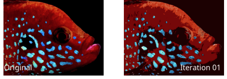
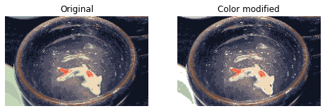

# Color-Segmentation

This project is about grouping a picture into an inputed amount of colors. This could later be used to modify colors.

Example of color modification: Color of plate on left bottom corner is modified to white.

It could also be used to detect different shapes in the picture.

To do this, I used a method called K-means clustering. These are the steps:
1. Generate a ceratain number of random colors. These are the centroids. The amount of colors could be inputed by the user. 
2. Group all the pixels to the centroid with the closest color. 
3. Make centroids the average of all the pixels assigned to it. 
4. Repeat steps 2 to 3 until it converges. This is when there little difference between each iteration or run. The user could also terminate the code when they are satisfied with the error difference. The error differce is the difference from the original image and the result from the iteration.

Between each iteration, the results would change because the centroids and groups would adjust.  
